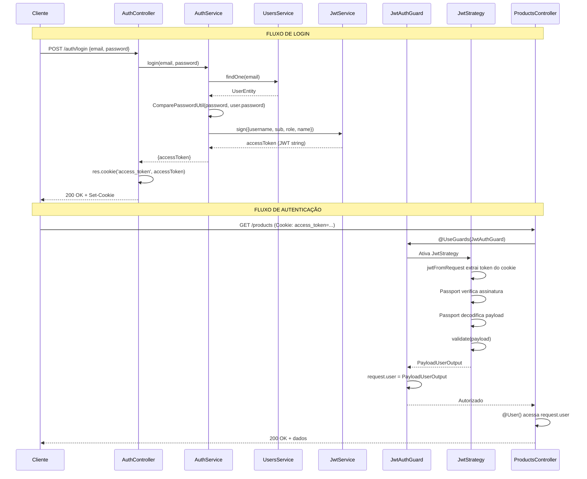

# Fluxo de Autenticação JWT com NestJS e Passport

Este documento explica detalhadamente como funciona o fluxo de autenticação JWT no projeto QRCode Menu.

## 📋 Índice

1. [Visão Geral](#visão-geral)
2. [Fluxo de Login](#fluxo-de-login)
3. [Fluxo de Autenticação (Rotas Protegidas)](#fluxo-de-autenticação-rotas-protegidas)
4. [Componentes Principais](#componentes-principais)
5. [Exemplos de Código](#exemplos-de-código)

---

## Visão Geral

O sistema de autenticação utiliza:
- **JWT (JSON Web Token)** para autenticação stateless
- **HTTP-only Cookies** para armazenamento seguro do token
- **Passport.js** para estratégia de autenticação
- **NestJS Guards** para proteção de rotas

---

## Fluxo de Login

### 1. Cliente Envia Credenciais

```http
POST /auth/login
Content-Type: application/json

{
  "email": "jander.webmaster@gmail.com",
  "password": "senha123"
}
```

### 2. AuthController Recebe a Requisição

```typescript
// auth.controller.ts
@Post('login')
async login(@Body() loginDto: LoginDto, @Res() res: Response) {
  const { accessToken } = await this.authService.login(
    loginDto.email, 
    loginDto.password
  );
  
  // Define o token em um cookie HTTP-only
  res.cookie('access_token', accessToken, {
    httpOnly: true,
    secure: process.env.NODE_ENV === 'production',
    maxAge: 3600000 // 1 hora
  });
  
  return res.json({ message: 'Login successful' });
}
```

### 3. AuthService Valida e Gera Token

```typescript
// auth.service.ts
async login(email: string, password: string) {
  // 3.1 - Busca o usuário no banco
  const user = await this.usersService.findOne(email);
  
  // 3.2 - Compara a senha
  const isPasswordValid = await ComparePasswordUtil(password, user.password);
  
  if (!user || !isPasswordValid) {
    throw new UnauthorizedException('Credenciais inválidas');
  }
  
  // 3.3 - Cria o payload do JWT
  const payload = {
    username: user.email,
    sub: user.id,
    role: user.role,
    name: user.name
  };
  
  // 3.4 - Assina e gera o token
  const accessToken = this.jwtService.sign(payload);
  
  return { accessToken };
}
```

### 4. Token JWT Gerado

O token gerado contém:

```json
{
  "username": "jander.webmaster@gmail.com",
  "sub": "69237da7af4e704d6912bedb",
  "role": "admin",
  "name": "Jander Nery",
  "iat": 1764168117,
  "exp": 1764171717
}
```

### 5. Cookie Enviado ao Cliente

```http
HTTP/1.1 200 OK
Set-Cookie: access_token=eyJhbGciOiJIUzI1NiIsInR5cCI6IkpXVCJ9...; HttpOnly; Path=/; Max-Age=3600

{
  "message": "Login successful"
}
```

---

## Fluxo de Autenticação (Rotas Protegidas)

### 1. Cliente Faz Requisição Autenticada

```http
GET /auth/profile
Cookie: access_token=eyJhbGciOiJIUzI1NiIsInR5cCI6IkpXVCJ9...
```

### 2. JwtAuthGuard Intercepta a Requisição

```typescript
// jwt-auth.guard.ts
@Injectable()
export class JwtAuthGuard extends AuthGuard('jwt') {
  // Ativa automaticamente a estratégia JWT
}
```

### 3. JwtStrategy - Extração do Token

```typescript
// jwt.strategy.ts
constructor() {
  super({
    // 3.1 - Define como extrair o token
    jwtFromRequest: ExtractJwt.fromExtractors([
      (request: any) => {
        // Extrai do cookie 'access_token'
        return request?.cookies?.access_token;
      },
    ]),
    ignoreExpiration: false,
    secretOrKey: jwtConstants.secret, // Chave secreta para verificar assinatura
  });
}
```

**O que acontece aqui:**
- O Passport chama a função extratora
- A função retorna o token JWT (string)
- O Passport verifica a assinatura usando `secretOrKey`
- Se válido, decodifica o payload

### 4. JwtStrategy - Validação do Payload

```typescript
// jwt.strategy.ts
async validate(payload: PayloadUserInput): Promise<PayloadUserOutput> {
  // 4.1 - Recebe o payload JÁ DECODIFICADO pelo Passport
  // payload = {
  //   username: "jander.webmaster@gmail.com",
  //   sub: "69237da7af4e704d6912bedb",
  //   role: "admin",
  //   name: "Jander Nery",
  //   iat: 1764168117,
  //   exp: 1764171717
  // }
  
  // 4.2 - Valida se tem os campos obrigatórios
  if (!payload || !payload.sub || !payload.role) {
    throw new UnauthorizedException();
  }
  
  // 4.3 - Retorna objeto formatado
  return {
    userId: payload.sub,
    username: payload.username,
    name: payload.name,
    email: payload.username,
    role: payload.role
  };
}
```

**Importante:** O `payload` recebido no `validate()` **JÁ ESTÁ DECODIFICADO**. Você não precisa fazer nada para extrair ou decodificar o token!

### 5. Passport Anexa ao Request

O objeto retornado pelo `validate()` é automaticamente anexado ao `request.user`:

```typescript
request.user = {
  userId: "69237da7af4e704d6912bedb",
  username: "jander.webmaster@gmail.com",
  name: "Jander Nery",
  email: "jander.webmaster@gmail.com",
  role: "admin"
}
```

### 6. Controller Acessa os Dados do Usuário

```typescript
// auth.controller.ts
@Get('profile')
@UseGuards(JwtAuthGuard)
getProfile(@User() user: PayloadUserOutput) {
  // user contém os dados retornados do validate()
  return user;
}
```

### 7. Resposta ao Cliente

```json
{
  "userId": "69237da7af4e704d6912bedb",
  "username": "jander.webmaster@gmail.com",
  "name": "Jander Nery",
  "email": "jander.webmaster@gmail.com",
  "role": "admin"
}
```

---

## Componentes Principais

### 🔐 JwtStrategy

**Responsabilidade:** Configurar como o JWT é extraído e validado

**Localização:** `src/infra/strategies/jwt.strategy.ts`

**Métodos:**
- `constructor()`: Configura extração e verificação do token
- `validate(payload)`: Valida e formata o payload decodificado

### 🛡️ JwtAuthGuard

**Responsabilidade:** Proteger rotas que requerem autenticação

**Localização:** `src/infra/guard/jwt-auth.guard.ts`

**Uso:**
```typescript
@UseGuards(JwtAuthGuard)
```

### 🎯 User Decorator

**Responsabilidade:** Extrair dados do usuário autenticado

**Localização:** `src/infra/decorators/user.decorator.ts`

**Uso:**
```typescript
@User() user: PayloadUserOutput
@User('userId') userId: string
@User('role') role: string
```

### 🔑 AuthService

**Responsabilidade:** Lógica de autenticação (login, validação)

**Localização:** `src/application/services/auth.service.ts`

**Métodos:**
- `validateUser()`: Verifica credenciais
- `login()`: Gera token JWT

---

## Exemplos de Código

### Proteger uma Rota

```typescript
@Controller('products')
export class ProductsController {
  @Get()
  @UseGuards(JwtAuthGuard) // Requer autenticação
  findAll(@User() user: PayloadUserOutput) {
    console.log('Usuário autenticado:', user.username);
    return this.productsService.findAll();
  }
}
```

### Acessar Dados Específicos do Usuário

```typescript
@Get('my-products')
@UseGuards(JwtAuthGuard)
getMyProducts(@User('userId') userId: string) {
  return this.productsService.findByUserId(userId);
}
```

### Verificar Role do Usuário

```typescript
@Post('admin-only')
@UseGuards(JwtAuthGuard)
adminAction(@User() user: PayloadUserOutput) {
  if (user.role !== 'admin') {
    throw new ForbiddenException('Apenas administradores');
  }
  
  return this.adminService.doSomething();
}
```

---

## Diagrama de Sequência Completo



---

## 🔒 Segurança

### Boas Práticas Implementadas

✅ **HTTP-only Cookies**: Token não acessível via JavaScript (previne XSS)  
✅ **Secure Flag**: Cookie só enviado via HTTPS em produção  
✅ **Expiração**: Token expira após 1 hora  
✅ **Secret Key**: Chave secreta forte para assinar tokens  
✅ **Password Hashing**: Senhas criptografadas com bcrypt  

### Melhorias Futuras

- [ ] Implementar refresh tokens
- [ ] Adicionar rate limiting
- [ ] Implementar blacklist de tokens
- [ ] Adicionar 2FA (autenticação de dois fatores)
- [ ] Implementar CSRF protection

---

## 📚 Referências

- [NestJS Authentication](https://docs.nestjs.com/security/authentication)
- [Passport JWT Strategy](http://www.passportjs.org/packages/passport-jwt/)
- [JWT.io](https://jwt.io/)
- [OWASP Authentication Cheat Sheet](https://cheatsheetseries.owasp.org/cheatsheets/Authentication_Cheat_Sheet.html)

---

**Última atualização:** 2025-11-26  
**Autor:** Jander Nery
